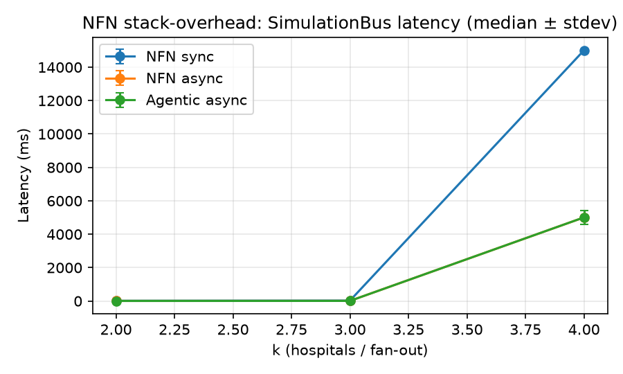
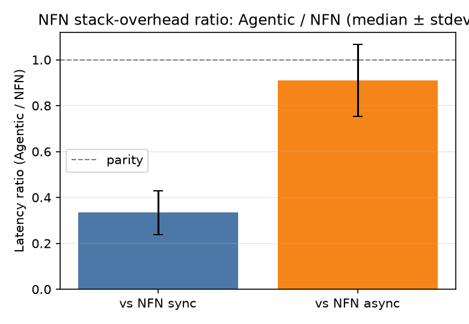
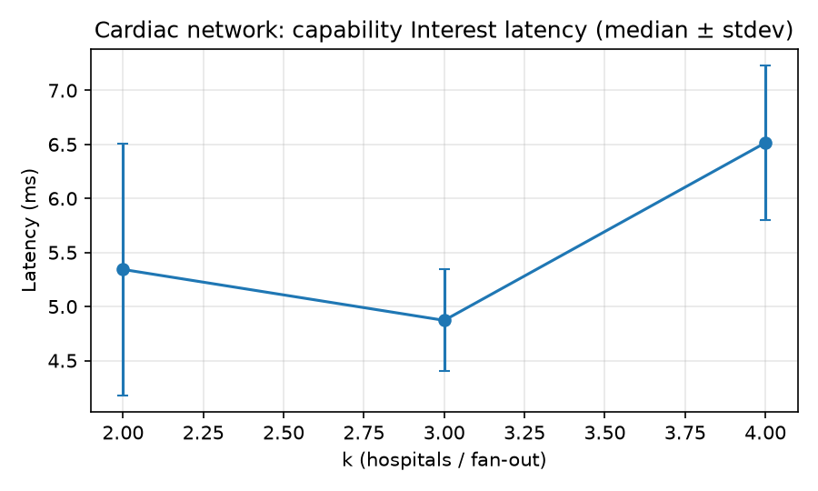
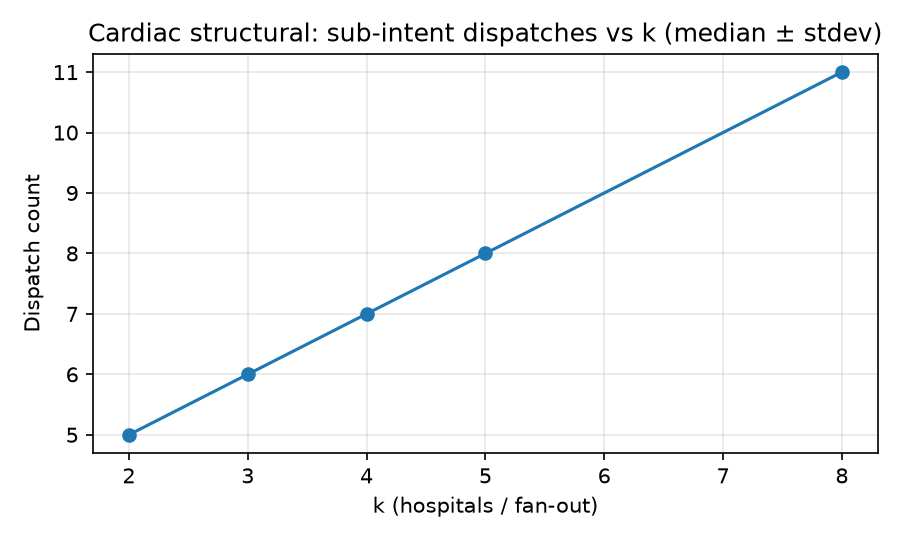
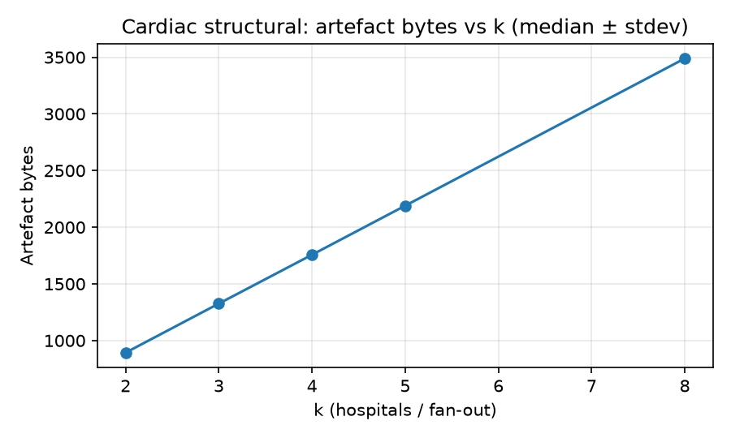
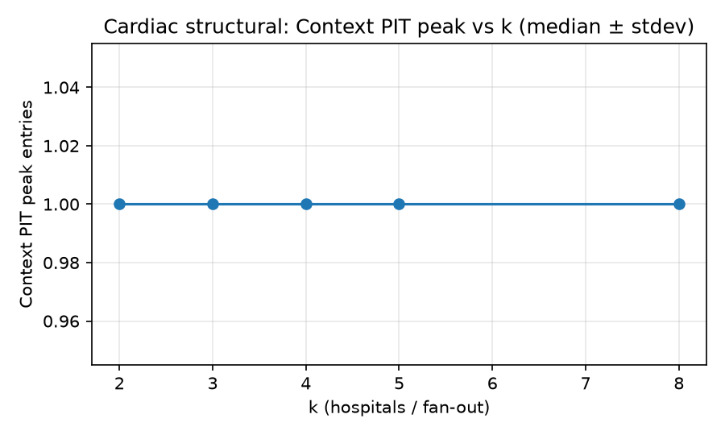

# ComMag evaluation note — Agentic vs plain NFN (prototype)

_Generated 2026-08-06 13:26 UTC. Prototype-scale, synthetic scenario on PiCN `SimulationBus`. Language is deliberately calibrated for an IEEE Communications Magazine revision (illustrative, not validation)._ 

## 1. Scope and framing

This note accompanies a working prototype of capability-oriented forwarding beside Named Function Networking (NFN) on a modernized PiCN stack (Python 3.14, asyncio). It reports **three complementary campaigns**:

1. **Cardiac structural (in-process)** — mechanisms of the agentic layer (Context PIT, dispatch/aggregation, artefact sizes, adversary KP-A detection) at small hospital counts `k`.
2. **Cardiac network demo (SimulationBus)** — ambulance `submit_intent` emits `/cap/fwd/...` capability Interests; edge `AgenticForwarder` returns hospital capacity Content; ambulance aggregates and ranks (paper §usecase wire story).
3. **NFN stack-overhead (SimulationBus)** — the **same NFN combine interest** under `NFNForwarder` sync/async and `AgenticForwarder` async (AgenticLayer idle for that name).

Numbers below are **preliminary** and must be read with the comparison and scale stated explicitly. Absolute SimulationBus wall-clock latency is **not** a deployment figure. The **Agentic / NFN latency ratio** (legacy id M3; prefer **nfn_stack_overhead**) on the shared combine interest is a microbenchmark, **not** cardiac capability routing.

## 2. Exact setup (read this first)

Do not mix the three campaigns. Capability maps become `/cap/fwd/...` Interests — they are **not** rewritten as NFN λ-names (paper CH1 is future work).

### 2.1 NFN stack-overhead — SimulationBus NFN combine

This is what produces the **with vs without agentic** latency tables and the publishable stack-overhead ratio.

**Who sends what.** A PiCN `Fetch` client issues one Interest and waits for Content. Nobody sends cardiac / capability Interests on the bus in this campaign.

**Exact name (Interest).** Built by `nfn_combine_interest(k)`:

```text
/func/combine/_("h0","h1")/NFN                    # k_eff=2
/func/combine/_(_("h0","h1"),"h2")/NFN            # k_eff=3
/func/combine/_(_(_("h0","h1"),"h2"),"h3")/NFN  # k_eff=4
```

Nesting depth is capped at 4 (`k_eff = min(k, 4)`); deeper nests hang on sync NFN under SimulationBus. The last component is the NFN marker, so this is a **classic NFN computation name**, not a capability name such as `/cap/fwd/hospital/beds/...`.

**Where it is sent.** `Fetch` is attached to the primary forwarder's SimulationBus face (e.g. `nfn0` or `agentic0`). The Interest travels: Fetch → bus → primary node link layer → up the stack. Mgmt on the primary node installs:

- a face toward the companion node,
- FIB prefix `/func` → that face,
- CS content `/func/combine` = Python `def func(a, b): return str(a) + str(b)`.

**Nodes per strategy (always 3 faces on one `SimulationBus`).**

| Strategy | Node A (primary) | Node B | Client |
|----------|------------------|--------|--------|
| `nfn_sync` / `nfn_async` | `NFNForwarder` | `NFNForwarder` | `Fetch` |
| `agentic_async` | `AgenticForwarder` | `NFNForwarder` | `Fetch` |

So: **two forwarders + one fetch client**. Only the `agentic_async` primary runs an `AgenticLayer`. The companion is always a plain `NFNForwarder` (async when the primary is async).

**Does the Interest go through NFN or bypass it?** It **goes through NFN** and is executed there. Stack on `AgenticForwarder` (top → bottom):

```text
AgenticLayer
NFNLayer          ← claims names ending in /NFN; runs combine
Chunk / Timeout / ICN / PacketEncoding / Link
```

NFN claims the combine Interest; `AgenticLayer` is **present in the stack** but does **not** perform capability matching or Context-PIT decomposition for this name. The ratio therefore measures "NFN fetch with an idle AgenticLayer above NFN" vs "plain NFNForwarder", **not** cardiac capability routing.

### 2.2 Cardiac network demo — capability Interests on SimulationBus

Paper-aligned wire story (`python -m demo.run_cardiac_bus`):

```text
ambulance PicnSubstratePort + AgenticLayer.submit_intent
  → Interest /cap/fwd/enrichment
  → Interest /cap/fwd/hospital/beds/h0  (…/h1 …)
  → Interest /cap/fwd/traffic
  → Interest /cap/fwd/ranking
edge AgenticForwarder CS answers with Content
ambulance aggregates Context~PIT trace root and ranks hospitals
```

Hospital capacity is published as distinct capability Content names (optional `paediatric_team` claim). This campaign does **not** use NFN λ-names.

### 2.3 Cardiac structural (in-process agentic)

This is what produces dispatch / PIT / artefact-byte figures and adversary M4.

**Scenario (who sends what).** An abstract ambulance intake orchestrator (Python, `CardiacScenario`) commits a parent intent, then "forwards" sub-intents to:

- 1 enrichment leaf,
- **`k` hospital** capability producers (`hospital/beds`, `DeterministicBackend` returning `beds_free`),
- 1 traffic leaf,
- 1 ranking leaf.

Hospitals return signed capacity claims (attestation quotes). Aggregation builds a Merkle **trace root**. On the adversary path, one hospital advertises inflated beds; KP-A compares claims to world truth and **deprioritises** (does not ban) that hospital.

**Not on SimulationBus.** No PiCN Interest/Content is exchanged for these leaves in the structural campaign. Context PIT / reputation / accountability run in-process. Harness `transport=bus` is only metadata for A-011 gates.

### 2.4 How we extract agentic numbers without mgmt APIs

Stock `AsyncMgmt` only sees CS / FIB / PIT / faces — **not** C-FIB, Context PIT, Steer, or reputation (future agentic mgmt surface). Numbers come from the **Python API**:

| Quantity | Source |
|----------|--------|
| NFN stack-overhead latency | `time.perf_counter` around `Fetch.fetch_data[_async]` |
| Context PIT peak, dispatch count, aggregation count, artefact bytes | `CardiacScenario` return dict → harness `MetricEvent`s |
| M4 detection | adversary artefacts `kpa_mismatches` |
| Trace root / ranking | walkthrough / scenario artefacts |
| Cardiac network Interests | `demo.run_cardiac_bus` / `RecordingPicnSubstratePort` |

So we instrument **inside** the scenario/harness, not by scraping HTTP mgmt.

### 2.5 How an agentic intent becomes routable names (not NFN lambdas)

A common mental model is: JSON intent → decomposer → NFN λ-expression names. **That is not how this prototype works.** Agentic routing and NFN computation use **different name spaces**.

#### Agentic path (capability names)

1. **Parent intent attributes** (for template selection) are a small JSON-like map, e.g. `{"scenario": "cardiac"}`. They are **not** the Interest name.
2. A signed **task-graph template** (JCS JSON body, kind `task-graph-template`) describes operators `SEQ` / `PAR` / `ALT` / `LEAF`. Each `LEAF` carries a **capability path**, e.g. `["hospital", "beds"]` — not an NFN expression.
3. `BoundedDecomposer.decompose(intent_attrs, bindings)` matches predicates and emits a deterministic list of `SubIntent` objects `(index, capability, bindings)`. Example emission for a PAR of eta / rank / beds:

```text
SubIntent(0, capability=("eta",), …)
SubIntent(1, capability=("rank",), …)
SubIntent(2, capability=("hospital", "beds"), …)
```

4. `AgenticLayer.submit_intent(...)` commits those leaves to the Context PIT, then for each leaf calls the substrate with:

```text
Name:    /cap/fwd/<capability-path…>     # G.1 simplified wire form
         # Full public form (naming module):
         # /cap/<issuer-digest>/<path…>/v=<version>
Payload: JSON bytes (e.g. {"patient_id": "demo"})
```

5. Those Interests are **capability Interests**. On a PiCN stack they travel **past** NFN (NFN only claims names ending in the `NFN` marker) up to `AgenticLayer` / producers. They are **not** rewritten into `/func/…/_("a",/data/x)/NFN` lambdas.

#### NFN path (lambda / combine names) — separate

NFN names look like:

```text
/func/combine/_("h0","h1")/NFN
```

The **NFN stack-overhead** campaign uses **only** that NFN form (Fetch → combine). No decomposer, no `/cap/…` names, no JSON intent body for routing. **Cardiac structural** metrics use Context PIT + capability paths **in-process** (and currently hard-code leaf specs rather than calling `BoundedDecomposer` on every run). **Cardiac network** puts `/cap/fwd/...` Interests on SimulationBus.

```text
JSON intent attrs ──► BoundedDecomposer ──► SubIntent(capability path)
                                            │
                                            ▼
                              /cap/…/hospital/beds/v=…  + JSON payload
                              (capability routing / C-FIB)

                    ≠

                     /func/combine/_(…)/NFN
                     (NFN executor; stack-overhead microbenchmark)
```

## 3. Configuration

| Campaign | Seeds | `k` values | Paths / strategies |
|----------|-------|------------|--------------------|
| Cardiac structural | `[1, 2, 3, 4, 5]` | `[2, 3, 4, 5, 8]` | happy, adversary |
| NFN stack-overhead | `[1, 2, 3, 4, 5, 6, 7, 8, 9, 10]` | `[2, 3, 4]` | nfn_sync, nfn_async, agentic_async |
| Cardiac network demo | `[1, 2, 3, 4, 5]` | `[2, 3, 4]` | `/cap/fwd` Interests |

- Cardiac structural runs: **50** (happy=25, adversary=25)
- NFN stack-overhead paired comparisons: **30**
- Cardiac network runs: **15**
- Agents: `DeterministicBackend` only (no live LLM; AC3).
- Transport: PiCN `SimulationBus` for network campaigns; structural harness label `transport=bus` (in-process mechanisms).
- **Variance**: all multi-run tables report sample standard deviation (stdev) alongside mean/median.

## 4. Results — NFN stack-overhead (SimulationBus)

Fetch latency for the identical nested `combine` interest (trimmed >500 ms cold-start stalls). **Mean ± stdev** and median:

| Strategy | Median (ms) | Mean ± stdev (ms) | n |
|----------|-------------|-------------------|---|
| NFNForwarder sync | 23.780 | 27.069 ± 26.064 | 20 |
| NFNForwarder async | 8.882 | 9.001 ± 2.514 | 20 |
| AgenticForwarder async | 7.224 | 7.591 ± 2.267 | 20 |

_Absolute latencies report median after dropping samples >500 ms (SimulationBus cold-start / teardown stalls). Stdev uses the same trimmed sample set (sample standard deviation)._

### NFN stack-overhead ratios (publishable; legacy id M3)

| Comparison | Median | Mean ± stdev |
|------------|--------|--------------|
| Agentic / NFN async | **0.910** | 0.914 ± 0.156 |
| Agentic / NFN sync | 0.334 | 0.350 ± 0.096 |

A median ratio near **1.0** against async NFN suggests that, at this prototype scale and for this **NFN combine** workload, placing `AgenticLayer` above NFN does not introduce large additional fetch latency beyond the async NFN baseline. Stdev quantifies run-to-run fluctuation on SimulationBus.





## 4b. Results — cardiac network (capability Interests)

Ambulance `submit_intent` → `/cap/fwd/...` Interests on SimulationBus → edge CS Content → Context~PIT aggregation. Runs: **15** (seeds `[1, 2, 3, 4, 5]`, k `[2, 3, 4]`).

| Metric | Median | Mean ± stdev | n |
|--------|--------|--------------|---|
| elapsed_ms | 5.343 | 5.343 ± 0.953 | 15 |

Per-`k` capability-Interest latency:

| k | n | Median (ms) | Mean ± stdev (ms) |
|---|---|-------------|-------------------|
| 2 | 5 | 5.343 | 5.055 ± 1.165 |
| 3 | 5 | 4.872 | 4.876 ± 0.470 |
| 4 | 5 | 6.515 | 6.099 ± 0.714 |



## 5. Results — cardiac structural (in-process)

In-process agentic mechanisms scale with `k`. Values are **mean ± stdev** across seeds (happy path).

| k | Dispatch (mean ± stdev) | PIT peak (mean ± stdev) | Artefact bytes (mean ± stdev) |
|---|-------------------------|-------------------------|--------------------------------|
| 2 | 5.0 ± 0.00 | 1.0 ± 0.00 | 893 ± 0.0 |
| 3 | 6.0 ± 0.00 | 1.0 ± 0.00 | 1326 ± 0.0 |
| 4 | 7.0 ± 0.00 | 1.0 ± 0.00 | 1757 ± 0.0 |
| 5 | 8.0 ± 0.00 | 1.0 ± 0.00 | 2190 ± 0.0 |
| 8 | 11.0 ± 0.00 | 1.0 ± 0.00 | 3489 ± 0.0 |

Adversary KP-A detection rate (M4): **1.00 ± 0.00** over n=25 adversary runs (prototype oracle).







## 6. What a ComMag revision can claim

Suggested calibrated claims (item-25 style):

1. **Artifact**: public fork with runnable `demo/` scripts and tests (cardiac walkthrough; cardiac network bus; NFN stack-overhead pairing).
2. **Qualifying number**: NFN stack-overhead median ≈ **0.91** (mean 0.91 ± 0.16) (AgenticForwarder async / NFNForwarder async) for the shared combine interest at `k ∈ [2, 3, 4]`, seeds `1…10`, SimulationBus, prototype-scale synthetic scenario.
3. **Mechanism evidence**: cardiac happy/adversary paths demonstrate Context PIT commit-before-forward, Merkle trace roots, and KP-A deprioritisation (not ban). Cardiac network demo shows `/cap/fwd` Interests on SimulationBus.

Avoid: bare end-to-end latency as a headline; claims of deployment validation; or describing stack-overhead as full cardiac-over-bus leaf routing (use `run_cardiac_bus` for that).

## 7. How to reproduce

```bash
pip install -e ".[dev]" matplotlib
python -m demo.run_cardiac_bus --seeds 1-5 --k-list 2,3,4 \
  --out demo/results/cardiac_network.jsonl --replace-out \
  --summary-json demo/results/cardiac_network_summary.json
python -m demo.generate_commag_report
```

Raw JSONL: `demo/results/commag_eval/`. Figures and this report: `demo/report/`.

## 8. References (in-repo)

- [`docs/agentic_demo.md`](../../docs/agentic_demo.md)
- [`demo/README.md`](../README.md)
- [`docs/agentic.md`](../../docs/agentic.md)
